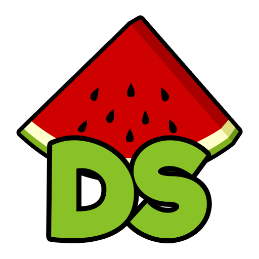

# Nintendo - DS (melonDS)

### Description

melonDS aims at providing fast and accurate Nintendo DS emulation.

### License

GPLv3

### Icon

### Fanart

Help make me fanart!

### Screenshots

Help make me screenshots!
